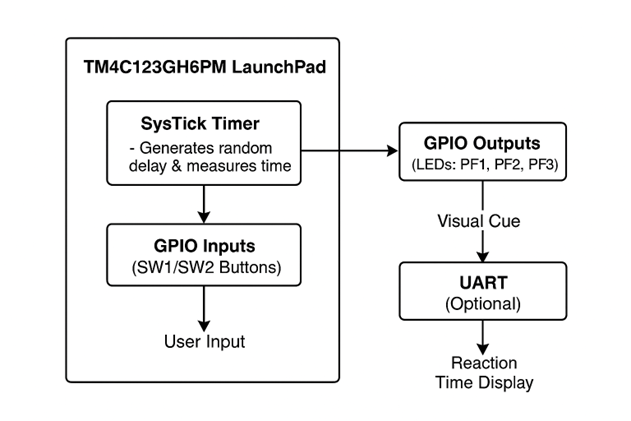

# Introduction
The Reaction Time Game was designed as an interactive embedded system to gauge how quickly a person can react to a visual signal. The microprocessor system design concepts covered throughout ECE 425 are thoroughly applied in this project. The Tiva TM4C123G LaunchPad Evaluation Board is used by the system to create a stand-alone game in which players must press a button as fast as they can when a red LED turns on.

Real-time feedback on performance, adjustable game parameters, a complete menu-based interface via UART serial communication, and statistical analysis of end results are all included within the game. The system can serve as a purpose in useful applications for human factors engineering, athletic training, and psychological testing in addition to its entertaining and fun value.

# Functional Block Diagram

# Results and Video Demonstration Link
[Video Demonstration](https://youtube.com/shorts/5YNZ5es2Iiw?feature=share)

# Background and Methodology
There were several key embedded systems concepts incorporated within the project:
1.	GPIO (General Purpose Input/Output) Control
-   3 LEDs (red, blue, and green) were configured as outputs for visual feedback
-	2 pushbuttons (SW1 and SW2) with internal pull-up resistors configured as inputs
-	Port F pins used for onboard peripherals
2.	Interrupt-Driven Programming
-	GPIO interrupts on PF4 (SW1) to detect button presses in real time
-	SysTick timer interrupts used for accurate timing measurements
-	Configuration of NVIC (Nested Vector Interrupt Controller)
3.	Timing Systems
-	SysTick timer set to 16 MHz system clock with a resolution of 1 ms
-	Measurement of reaction time with milliseconds
-	Generation of pseudo-random delays for inconsistent stimulus timing
4.	Serial Communication
-	UART configured for communication at a baud rate of 115200
-	Terminal-based user interface with menu navigation

A structural development procedure was followed in implementing the project:
1.	Defined game elements and features based on current tasks and other suggestions
2.	GPIO, SysTick, and UART drivers were implemented according to lab experience
3.	Integrated game logic and drivers in the main application
4.	Verified operation and functionality with systematic testing
5.	Improved user experience and accuracy of timing

# Table of Components Used
|     Component                                 |     Quantity    |     Description                                                                            |
|-----------------------------------------------|-----------------|--------------------------------------------------------------------------------------------|
|     Tiva C Series   TM4C123GH6PM LaunchPad    |     1           |     The main microcontroller   board                                                       |
|     Onboard   LEDs                            |     3           |     Visual   feedback                                                                      |
|     Onboard   Buttons                         |     2           |     User   input                                                                           |
|     USB-A to   Micro-USB Cable                |     1           |     Used to connect the   microcontroller to laptop/PC for programming and power supply    |
|     Laptop/PC                                 |     1           |     Environment   used for programming                                                     | 

# Table of Pins Used
|     Function         |     TM4C123GH6PM   Port Pin    |     Port     |     Direction    |     Internal   Configuration    |     Description                |
|----------------------|--------------------------------|--------------|------------------|---------------------------------|--------------------------------|
|     Red LED          |     PF1                        |     PORTF    |     Output       |     Digital   Output            |     Visual   signal            |
|     Blue LED         |     PF2                        |     PORTF    |     Output       |     Digital   Output            |     Failure   indicator        |
|     Green   LED      |     PF3                        |     PORTF    |     Output       |     Digital   Output            |     Success   indicator        |
|     Push   Button    |     PF4   (SW1)                |     PORTF    |     Input        |     Pull-up,   Interrupt        |     Primary   game button      |
|     Push   Button    |     PF0   (SW2)                |     PORTF    |     Input        |     Pull-up                     |     Secondary   game button    |
|     UART0 TX         |     PA1                        |     PORTA    |     Output       |     Alternate   function        |     Serial   transmit          |
|     UART0 RX         |     PA0                        |     PORTA    |     Input        |     Alternate   function        |     Serial   receive           |